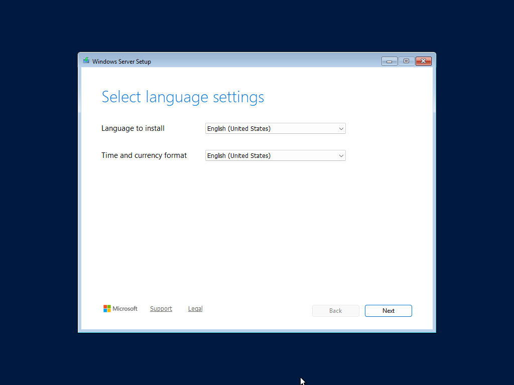
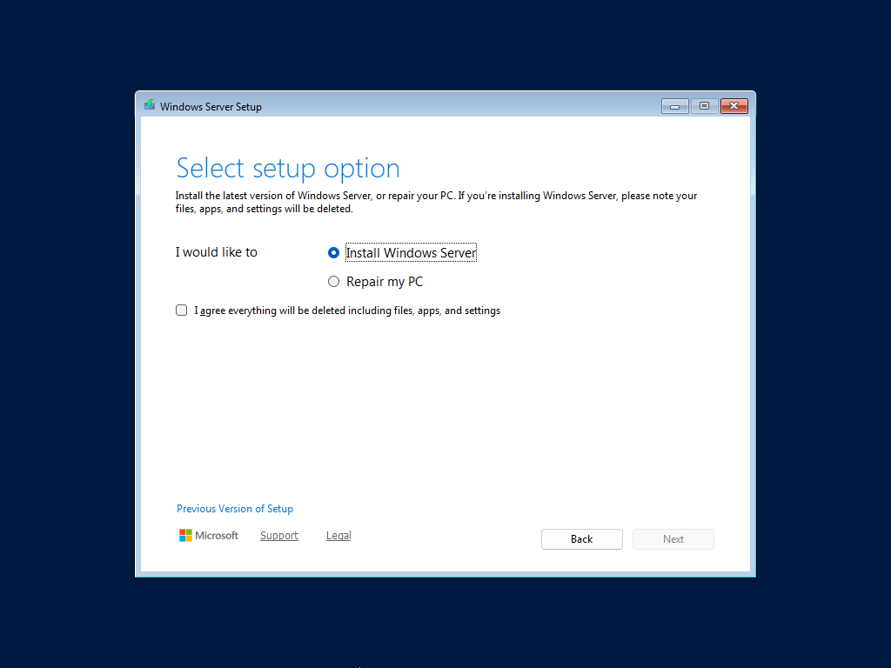
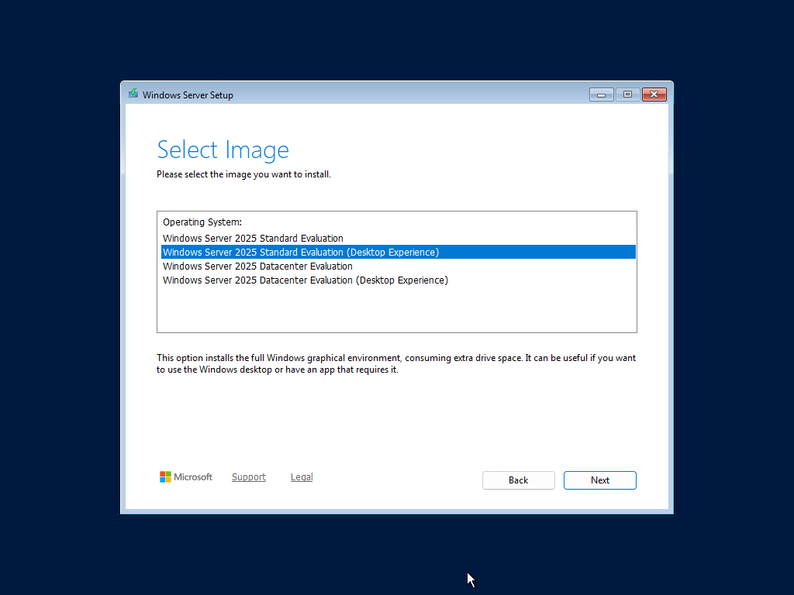
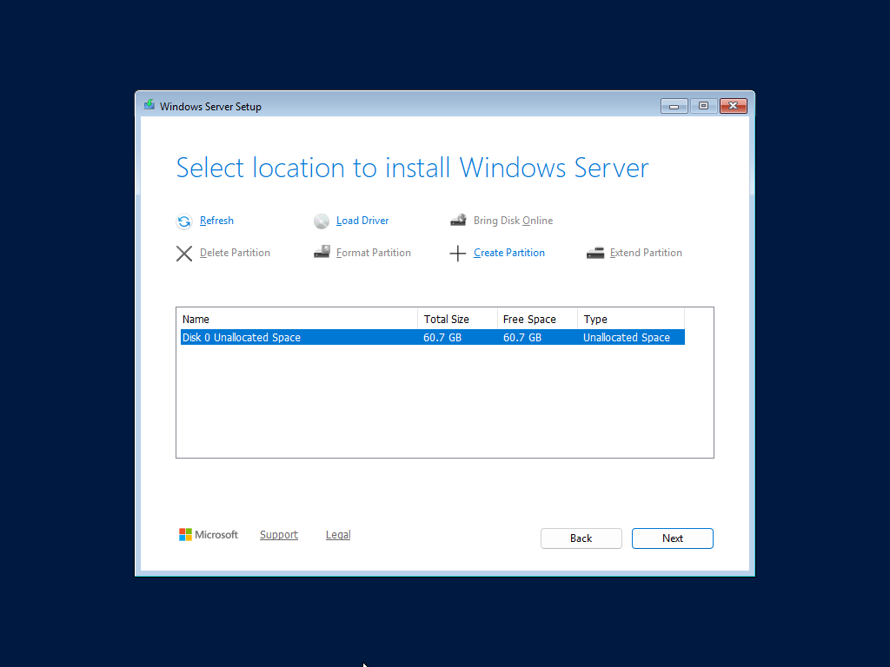
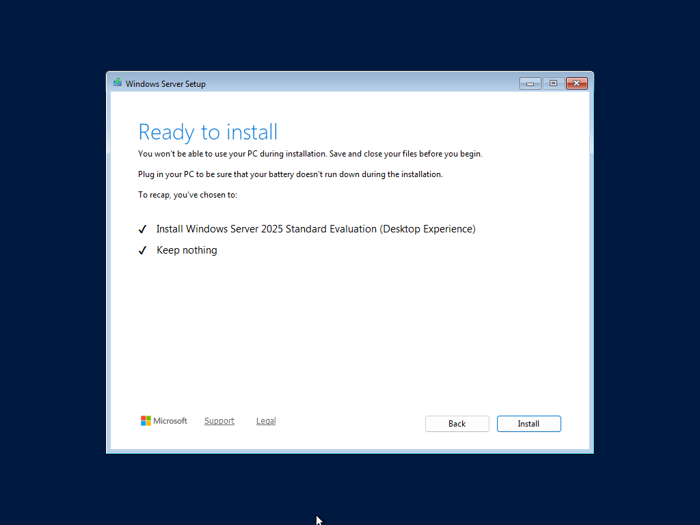
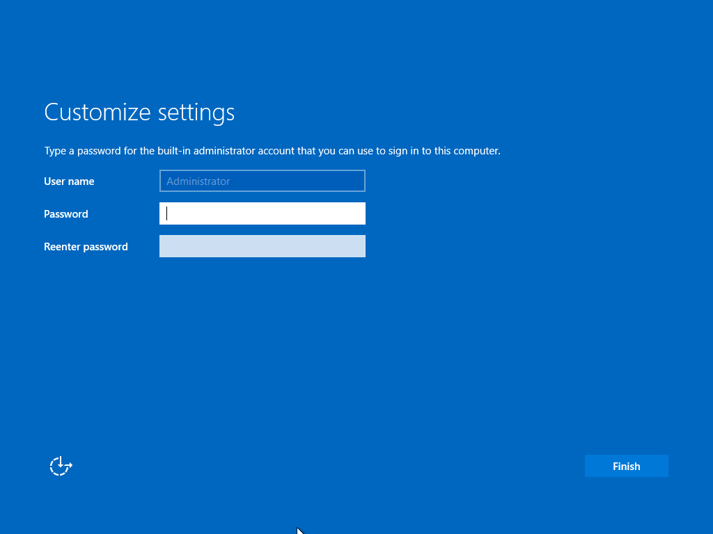

# 01 — Windows Server 2025 Installation

## Goal
Install Windows Server 2025 Standard Evaluation (Desktop Experience) on a new VirtualBox virtual machine.

## Why This Step Matters
Everything starts with a clean operating system. Choosing the "Desktop Experience" is important for this lab because it provides the Graphical User Interface (GUI), which is essential for learning Active Directory tools visually.

## Steps Taken
1. Created a new Virtual Machine in VirtualBox.
2. Mounted the Windows Server 2025 ISO.
3. Selected language, time, and keyboard settings.
4. Chose "Install Windows Server" (Custom Install).
5. Selected "Windows Server 2025 Standard Evaluation (Desktop Experience)".
6. Selected the unallocated space (60.7 GB) for installation.
7. Set the built-in Administrator password.
8. Completed installation and logged in.

## Screenshots

