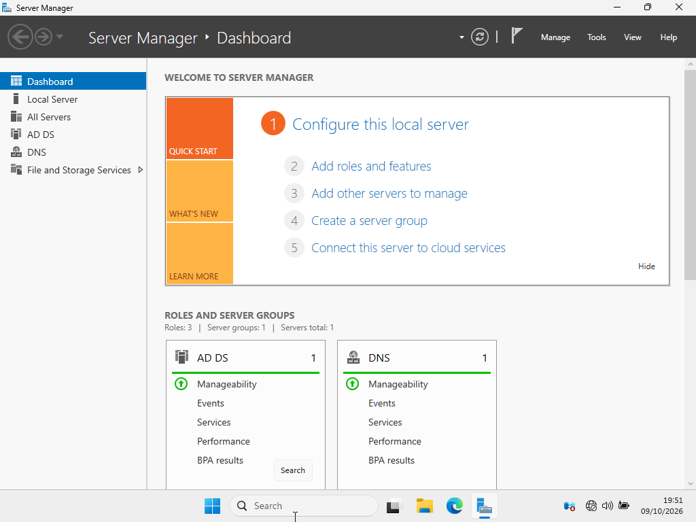
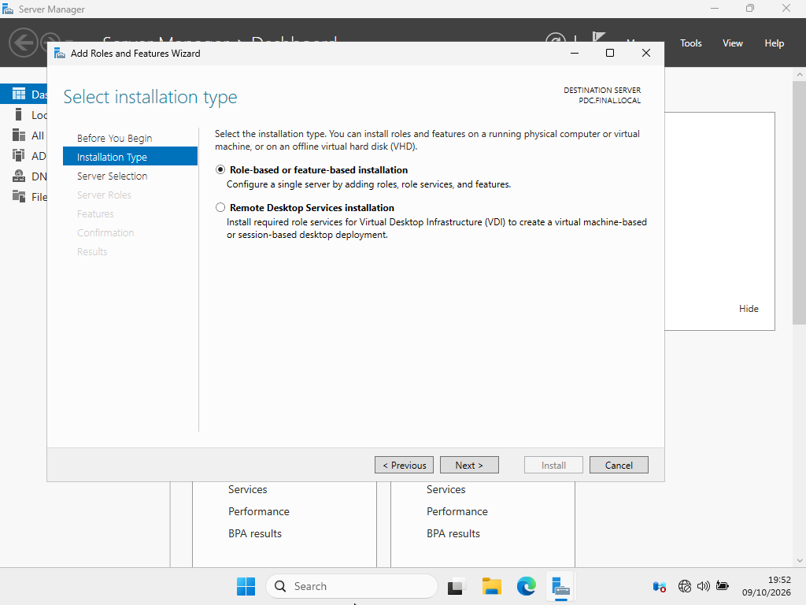
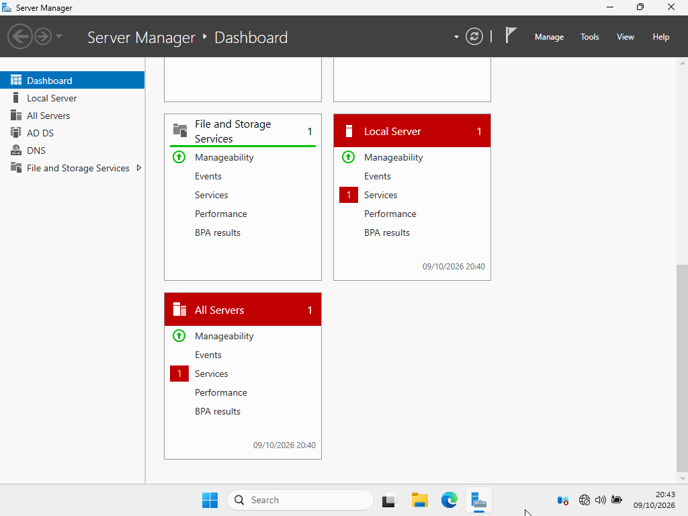
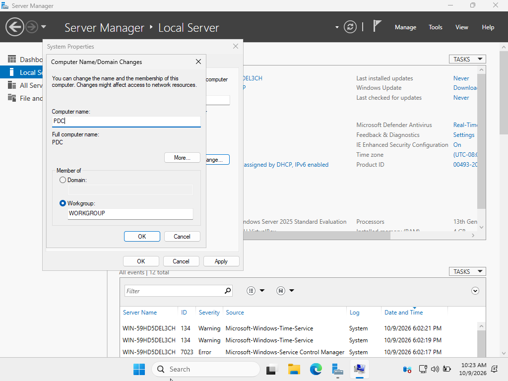
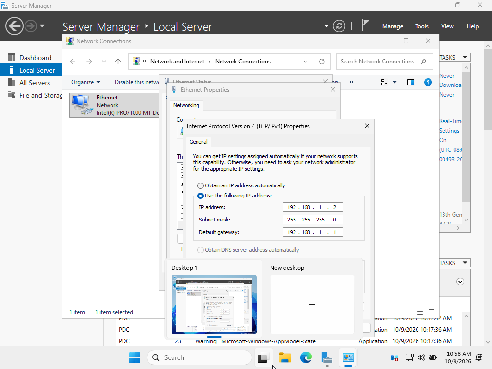

# 02 — Configure Server Name, Network, and Install AD DS Role

## Goal
Rename the server to PDC, configure a static IP, and install the Active Directory Domain Services (AD DS) role.

## Why This Step Matters
A Domain Controller needs a static IP so domain clients can always find it. It also needs a proper hostname (PDC) and the AD DS software installed before it can be promoted.

## Steps Taken
1. **Renamed the Server:** Changed the computer name from the default to `PDC`.
2. **Configured Static IP:** Set IPv4 to `192.168.1.2`, Subnet `255.255.255.0`, Gateway `192.168.1.1`.
3. **Installed AD DS Role:**
   - Opened Server Manager → Add Roles and Features.
   - Selected "Role-based or feature-based installation".
   - Checked "Active Directory Domain Services".
   - Completed the installation.
   - Verified via PowerShell: `Get-WindowsFeature -Name AD-Domain-Services` (showed as Installed).

## Screenshots

