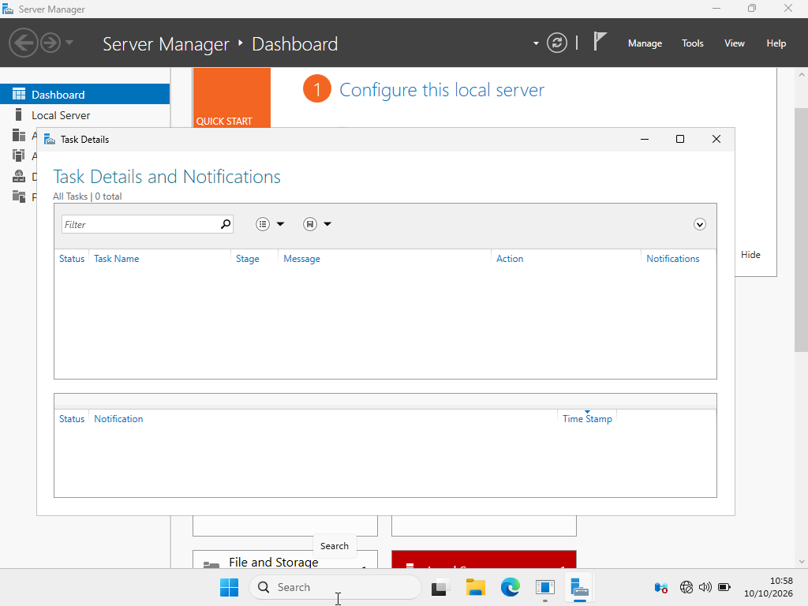
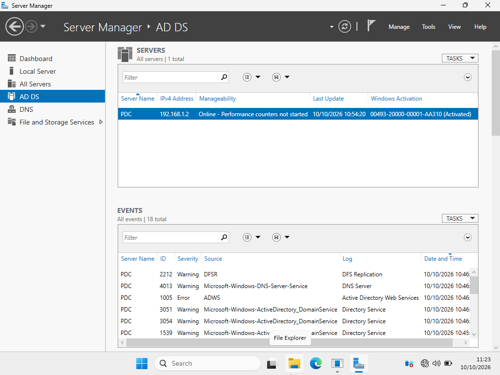
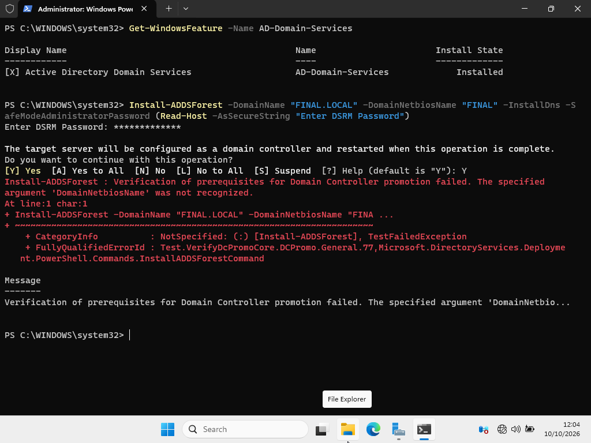
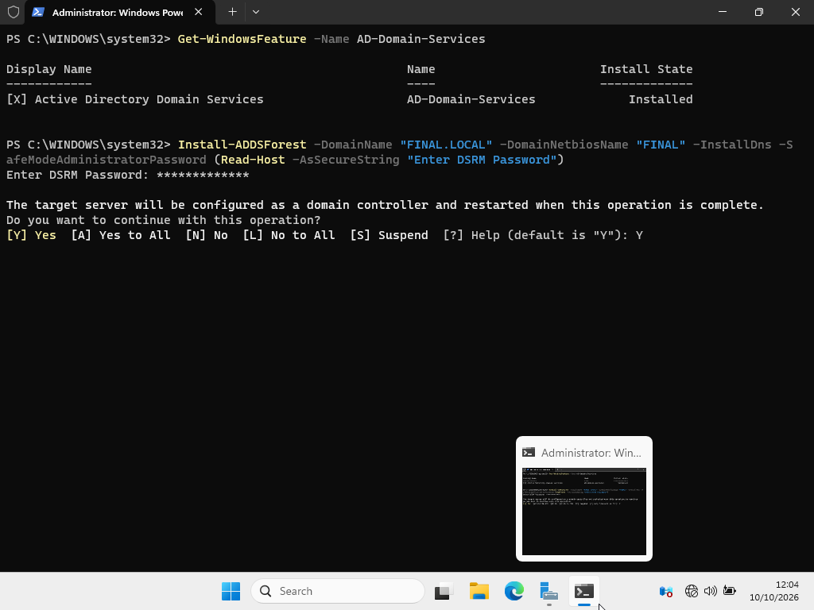
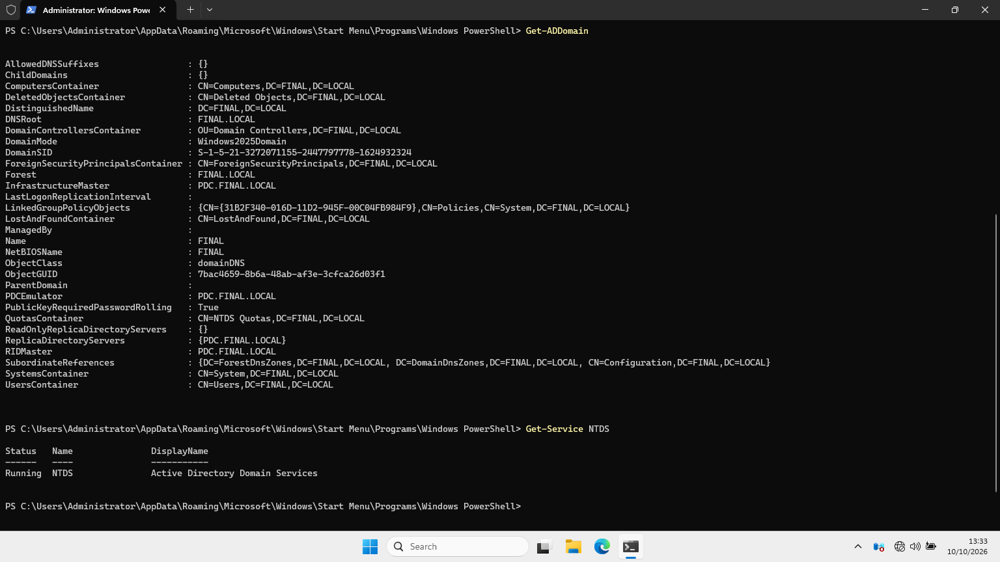

# 03 — Promote PDC to a Domain Controller (The Troubleshooting Journey)

## Goal
Promote PDC to a Domain Controller and create the FINAL.LOCAL forest.

## Why This Step Matters
Installing the AD DS role only puts the software on the machine. Promotion creates the forest, turns the server into a Domain Controller, and installs DNS.

## The Troubleshooting Story (Real-World Experience)
This step was a huge learning experience. Here is exactly what happened:

1. **The GUI Bug:** Server Manager's notification flag (to promote the server) was empty. 
   - *Diagnosis:* I checked the Event Viewer inside Server Manager and found Event ID **1066 (ADDS)** and **4013 (DNS)**, which confirmed the role was waiting for promotion but the GUI was stuck.

2. **PowerShell Error:** I attempted to promote via PowerShell using `Install-ADDSForest`.
   - *Error:* `Verification of prerequisites... The specified argument 'DomainNetbiosName' was not recognized.`
   - *Fix:* I removed the redundant parameter and used interactive mode.

3. **The False Negative:** The command failed again with `The specified argument 'NewDomain' was not recognized.`
   - *Diagnosis:* This is a known bug in Windows Server 2025. I verified the actual state of the server using `Get-ADDomain` and `Get-Service NTDS`. **The server was actually already promoted successfully!** The error was completely false.

## Steps Taken
1. Verified role: `Get-WindowsFeature -Name AD-Domain-Services`
2. Imported module: `Import-Module ADDSDeployment`
3. Ran interactive promotion:
   - `Install-ADDSForest`
   - Domain Name: `FINAL.LOCAL`
   - NetBIOS Name: `FINAL`
   - DSRM Password: Set and stored securely
4. Encountered the bug, but verified success using:
   - `Get-ADDomain` (Confirmed Forest: FINAL.LOCAL)
   - `Get-Service NTDS` (Confirmed Status: Running)

## Result
- PDC is now the first Domain Controller of the FINAL.LOCAL forest.
- DNS is installed and integrated.

## Screenshots

