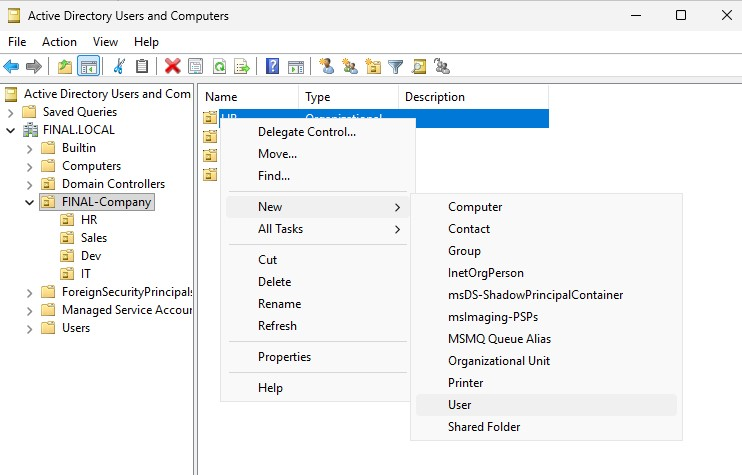
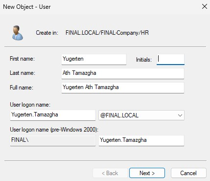
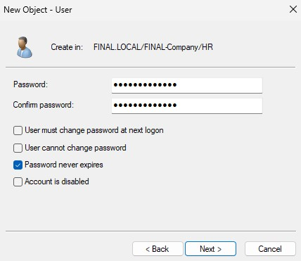
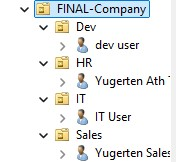
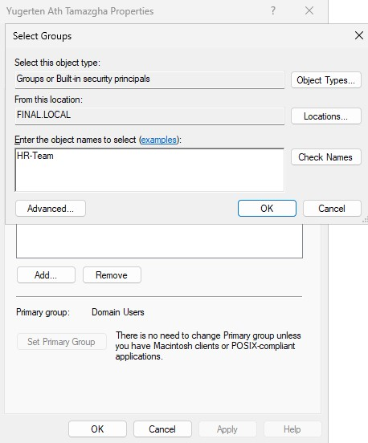
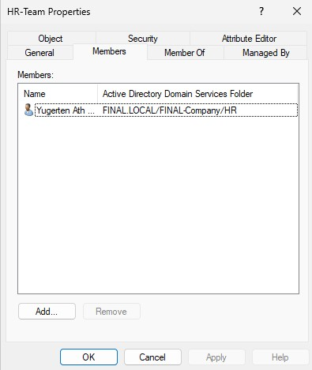
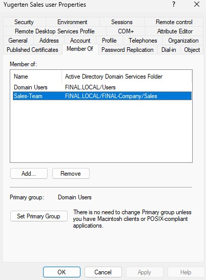
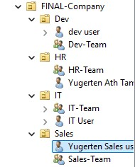

# 05 — Create Users and Security Groups

## Goal
Populate the departmental OUs with users and create security groups to manage permissions.

## Why This Step Matters
Users are the employees. Groups are how we assign permissions efficiently (e.g., instead of giving 50 people access to a folder one by one, we give the `HR-Team` group access). This follows the principle of Role-Based Access Control (RBAC).

## Steps Taken
1. Created users in their respective OUs:
   - HR: `Yugerten Ath Tamazgha` (Logon: `Yugerten.Tamazgha`)
   - Sales: `Yugerten Sales` (Logon: `sales.user`)
   - Dev: `Dev User` (Logon: `dev.user`)
   - IT: `IT User` (Logon: `it.user`)
2. Configured password settings: `P@ssw0rd2025!`, checked "Password never expires", unchecked "User must change password at next logon".
3. Created Global Security Groups inside each OU:
   - `HR-Team`, `Sales-Team`, `Dev-Team`, `IT-Team`
4. Added each user to their respective departmental group via the "Member Of" tab.

## Screenshots

### User Creation
<table>
  <tr>
    <td width="50%"><b>1. Creating a User in the HR OU</b> </td>
    <td width="50%"><b>2. Filling in User Details</b> </td>
  </tr>
  <tr>
    <td width="50%"><b>3. Setting the Password</b> </td>
    <td width="50%"><b>4. All Users Created</b> </td>
  </tr>
</table>

### Group Creation & Membership
<table>
  <tr>
    <td width="50%"><b>5. Adding a User to a Group</b> </td>
    <td width="50%"><b>6. Verifying Group Members</b> </td>
  </tr>
  <tr>
    <td width="50%"><b>7. User's "Member Of" Tab</b> </td>
    <td width="50%"><b>8. Final OU Structure</b> </td>
  </tr>
</table>
